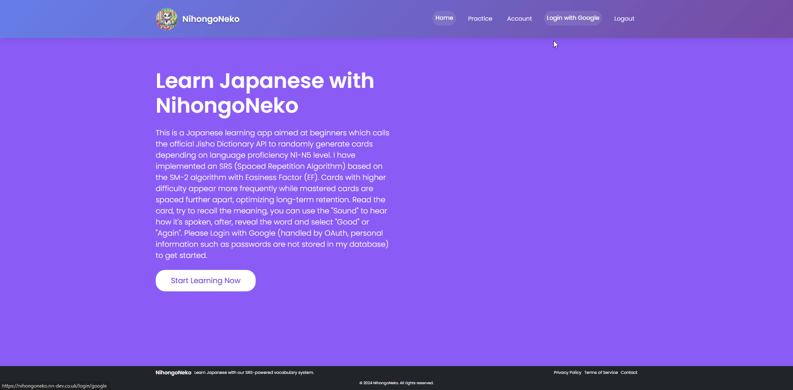
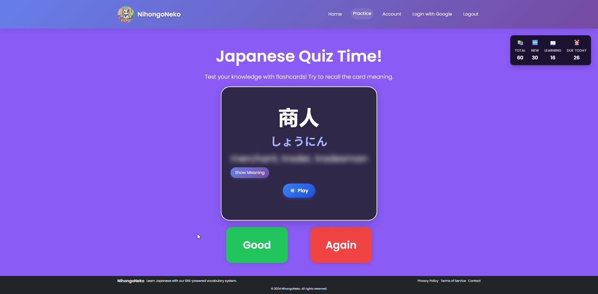
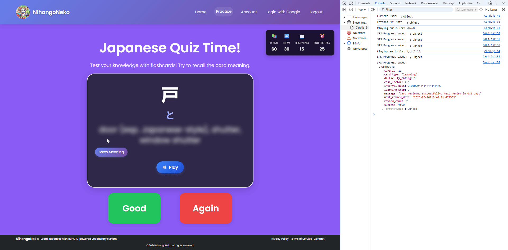

# NihongoNeko🐱 - Japanese Learning App - https://nihongoneko.nn-dev.co.uk/

As part of my language learning journey, I decided to build my own flashcard system to help cement vocabulary into long-term memory. The idea was to use a Spaced Repetition System (SRS) algorithm, which figures out the best time for a user to review a card so the word really sticks. With enough practice, this approach can make someone genuinely proficient in a language. The concept is inspired by the popular app Anki (https://apps.ankiweb.net/), but I wanted to create my own take on it.

The result is a comprehensive Japanese learning app that features OAuth authentication, an SRS algorithm, and integration with the Jisho dictionary API. The app pulls in randomized vocabulary ranging from beginner (N5) up to advanced (N1) levels and generates new flashcards, which are then stored in a database. As you study, you mark words as “Good” or “Again,” and the system uses that feedback to track your progress and intelligently adjust when the word will appear next. All accounts are created through Google sign-in, so no sensitive information or passwords are stored in the database. The whole experience is designed to adapt to each learner’s pace and performance, making vocabulary study more natural and effective.

Please scroll down for my how get started guide, features, specific tech stack, & how I've implemented my application with security at the forefront of it's creation!

## How to Use the App


### Getting Started
1. **Visit the Application**: Navigate to the live demo at `https://nihongoneko.nn-dev.co.uk`
2. **Sign In**: Click "Login with Google" to authenticate with your Google account
3. **Start Learning**: Click "Start Learning Now" to begin your Japanese vocabulary journey
A visual representation of this can be shown below, once you login, you're greeted with the "Accounts" page, simply, you'd browse over to "Practice" to get started, once all cards are completed, come back the next day! The OAuth flow was edited out of the below for security reasons.


  ### Learning Process
  1. **Card Presentation**: Each card shows a Japanese vocabulary word
  2. **Audio Playback**: Use the "Sound" button to hear proper pronunciation
  3. **Self-Assessment**: Try to recall the meaning before revealing the answer
  4. **Progress Rating**: Select "Good" or "Again" based on your performance
  5. **SRS Optimization**: The algorithm adjusts future review intervals based on your responses
  
  A visual representation is shown of this below:
  

  In the console here, we can see "Good" or "Again" marked and submitted to the database, the Machine Learning SRS Algorithm then determines in what interval the card should be next reviewed, tagging it with either the "learning" or "review" status for the Database. Individual user progress    is all tracked by the users GoogleID passed to us from the OAuth sign in, ensuring the individual user has persistance and their account progress is of course, their own:
  

## Features

### Core Learning Features
- **Smart SRS Algorithm** - Anki-style spaced repetition system with SM-2 algorithm and Easiness Factor (EF)
- **Adaptive Difficulty** - Cards with higher difficulty appear more frequently while mastered cards are spaced further apart
- **Japanese Dictionary Integration** - Real-time vocabulary lookup using the official Jisho API
- **Audio Pronunciation** - Text-to-speech functionality for proper Japanese pronunciation
- **Progress Tracking** - Comprehensive learning analytics and performance metrics
- **JLPT Level Support** - Vocabulary organized by N1-N5 proficiency levels

### Authentication & Security
- **Google OAuth 2.0** - Secure user login with Google accounts
- **Session Management** - Secure cookie-based authentication
- **Privacy-First** - No password storage, all authentication handled by Google

### User Experience
- **Responsive Design** - Modern UI that works seamlessly on desktop and mobile
- **Interactive Cards** - Flip-card interface for engaging vocabulary learning
- **Real-time Statistics** - Live progress tracking with visual indicators
- **Intuitive Navigation** - Clean, user-friendly interface with Bootstrap styling

## Security Implementation - I want to touch on my security implementations below, this was one of my main focuses.

### Authentication & Authorization
- **Google OAuth 2.0 Integration** - Industry-standard OAuth 2.0 with OpenID Connect
- **No Password Storage** - Zero password storage, all authentication delegated to Google
- **Secure Session Management** - Flask-Login with secure cookie configuration
- **Session Timeout** - 24-hour session lifetime with automatic expiration
- **Cross-Subdomain Sessions** - Secure cookie domain configuration for subdomain access

### Data Protection & Privacy
- **Environment-Based Secrets** - All sensitive data stored in environment variables
- **Database Security** - PostgreSQL with encrypted connections and secure authentication
- **No Sensitive Data Storage** - Only learning progress stored, no personal information
- **URL Encoding** - Database passwords properly encoded to handle special characters
- **Secure Configuration** - Production vs development environment separation

### Network Security
- **HTTPS Enforcement** - All communications encrypted in transit
- **CORS Configuration** - Restricted cross-origin requests to authorized domains only
- **Proxy Headers** - Proper handling of Cloudflare proxy headers for real IP detection
- **Secure Cookies** - HTTPOnly, Secure, and SameSite cookie attributes
- **Cloudflare Tunnel** - Secure external access through Cloudflare's infrastructure

### Application Security
- **SQL Injection Prevention** - SQLAlchemy ORM with parameterized queries
- **Input Validation** - Comprehensive input validation on all API endpoints
- **Error Handling** - Secure error handling without information leakage
- **Request Timeouts** - 5-10 second timeouts on external API calls
- **Database Rollback** - Automatic transaction rollback on errors

### Infrastructure Security
- **Docker Containerization** - Isolated application environment
- **Nginx Security** - Web server with security headers and static file serving
- **Database Isolation** - Separate PostgreSQL container with persistent volumes
- **Environment Separation** - Production vs development configuration isolation
- **Secret Management** - Environment variables for all sensitive configuration

### Privacy Compliance - Needed for making the app Public with OAuth
- **GDPR Compliance** - User data access, correction, and deletion rights
- **Data Minimization** - Only essential learning data stored
- **Transparent Privacy Policy** - Clear data usage and storage policies
- **User Control** - Complete user control over their learning data
- **Third-Party Transparency** - Clear disclosure of Google OAuth and Jisho API usage

## Complete Architecture

### Backend Services (Python Flask)
```
backend/
├── app.py                 # WSGI entry point for Gunicorn
├── JishoAPI.py           # Main Flask application with API endpoints
├── OAuth.py              # Google OAuth 2.0 implementation
├── SRSAlgo.py            # Spaced Repetition System algorithm (SM-2)
├── database.py           # SQLAlchemy models and database operations
├── config.py             # Configuration management and environment variables
├── dbinit.py             # Database initialization scripts
└── requirements.txt      # Python dependencies
```

**Key Backend Components:**
- **Authentication System**: Google OAuth 2.0 with secure session management
- **SRS Engine**: SM-2 algorithm with Easiness Factor for optimal learning intervals
- **API Integration**: Jisho dictionary API for vocabulary lookup and pronunciation
- **Database Layer**: PostgreSQL with SQLAlchemy ORM for data persistence
- **CORS Configuration**: Secure cross-origin resource sharing for frontend communication

### Frontend Application (HTML/CSS/JavaScript)
```
frontend/
├── html/                 # Main application pages
│   ├── index.html        # Landing page with app introduction
│   ├── Questions.html    # Main learning interface with SRS cards
│   ├── Account.html      # User dashboard with progress statistics
│   ├── Quiz.html         # Quiz mode interface
│   ├── Kanji.html        # Kanji-specific learning page
│   ├── App.js            # Main application logic
│   ├── Card.js           # Card component and SRS functionality
│   ├── Questions.js      # Learning interface logic
│   ├── button.js         # Authentication button handlers
│   └── style.css         # Custom styling and responsive design
├── reactjf/              # React components (optional)
├── config/               # Nginx configuration files
└── logs/                 # Application logs
```

**Frontend Features:**
- **Learning Interface**: Interactive card-based vocabulary system
- **Progress Dashboard**: Real-time statistics and learning analytics
- **Audio Integration**: Text-to-speech for Japanese pronunciation
- **Responsive Design**: Mobile-first approach with Bootstrap framework
- **Session Management**: Client-side authentication state handling

### Infrastructure & Deployment
```
Infrastructure Stack:
├── PostgreSQL Database    # Primary data storage with Docker containerization
├── Nginx Web Server      # Static file serving and reverse proxy
├── Docker Compose        # Multi-container orchestration
├── Cloudflare Tunnel     # Secure external access and routing
└── Gunicorn WSGI         # Production-ready Python application server
```

**Deployment Configuration:**
- **Database**: PostgreSQL with persistent volume storage
- **Web Server**: Nginx serving static files on port 8080
- **API Server**: Flask application on port 5001 with Gunicorn
- **External Access**: Cloudflare tunnel for secure HTTPS access
- **Environment**: Docker Compose for easy deployment and scaling


### Progress Tracking
- **Total Cards**: View your complete vocabulary deck size
- **New Cards**: Track cards you haven't learned yet
- **Learning Cards**: Monitor cards currently in the learning phase
- **Review Cards**: See cards scheduled for review
- **Success Rate**: Track your overall learning performance

## Tech Stack

### Backend Technologies
- **Python 3.9+** with Flask framework
- **SQLAlchemy ORM** for database operations
- **PostgreSQL** for data persistence
- **Gunicorn WSGI** for production deployment
- **Authlib** for OAuth 2.0 integration
- **Flask-Login** for session management
- **Flask-CORS** for cross-origin requests

### Frontend Technologies
- **HTML5/CSS3** with Bootstrap 5.3.0
- **Vanilla JavaScript** for application logic
- **Web Speech API** for text-to-speech
- **Fetch API** for backend communication
- **Responsive Design** with mobile-first approach

### Infrastructure
- **Docker & Docker Compose** for containerization
- **Nginx** for web server and reverse proxy
- **Cloudflare Tunnel** for secure external access
- **PostgreSQL** with persistent volume storage
- **Environment-based configuration** for security

## 🌟 Demo Features

This application serves as a comprehensive demo showcasing:
- **Modern Web Architecture**: Full-stack application with microservices
- **OAuth Integration**: Secure authentication with Google
- **Machine Learning**: SRS algorithm for personalized learning
- **API Integration**: Real-time dictionary lookups
- **Responsive Design**: Cross-platform compatibility
- **Production Deployment**: Docker-based containerization

**Live Demo**: https://nihongoneko.nn-dev.co.uk

**Built with ❤️ for language learners**
